<h1 align="center">Vellox</h1>

  <strong>Satu Aplikasi Desktop. Seluruh Kebutuhan YouTube Creator.</strong> 
  Riset · Analisis · AI · Download · Render — Semua dalam Satu Tempat.

  

  
  
  

---

## Daftar Isi

- [Apa Itu Vellox?](#-apa-itu-vellox)
- [Mengapa Vellox?](#-mengapa-vellox)
- [Fitur Lengkap](#-fitur-lengkap)
  - [Dashboard & Pipeline](#1--dashboard--pipeline-produksi)
  - [Analisis Produktivitas](#2--analisis-produktivitas)
  - [Jadwal Mingguan](#3--jadwal-mingguan)
  - [Manajemen Channel](#4--manajemen-channel)
  - [YouTube Analytics](#5--youtube-analytics)
  - [Riset Kompetitor](#6-️-riset-kompetitor)
  - [Trend Scanner](#7--trend-scanner)
  - [AI Tools Suite](#8--ai-tools-suite)
  - [Prompt Extractor](#9-️-prompt-extractor)
  - [Catatan & Notes](#10--catatan--notes)
  - [Downloader](#11--downloader-video--audio)
  - [Video Renderer](#12--video-renderer)
  - [Prompt Library](#13--prompt-library)
- [Privasi & Keamanan Data](#-privasi--keamanan-data)
- [Spesifikasi Teknis](#-spesifikasi-teknis)
- [Siapa yang Cocok Menggunakan Vellox?](#-siapa-yang-cocok-menggunakan-vellox)
- [Perbandingan dengan Alternatif Lain](#-perbandingan-dengan-alternatif-lain)
- [Lisensi & Harga](#-lisensi--harga)
- [FAQ](#-faq)
- [Kontak & Dukungan](#-kontak--dukungan)

---

## 📖 Apa Itu Vellox?

**Vellox** adalah aplikasi desktop all-in-one yang dirancang khusus untuk **YouTube creator**, **channel manager**, dan **video editor**. Vellox menggabungkan semua alat yang biasanya tersebar di berbagai website, aplikasi, dan browser tab — menjadi **satu workspace terpadu** yang berjalan sepenuhnya di komputer Anda.

Tidak perlu akun. Tidak perlu langganan bulanan. Tidak perlu koneksi internet untuk fitur inti. **Sekali beli, selamanya milik Anda.**

### Apa Saja yang Bisa Dilakukan dengan Vellox?

| Kebutuhan | Solusi di Vellox |
|-----------|-----------------|
| Melacak progress video dari ide sampai upload | ✅ Pipeline 7 tahap + kalender mingguan |
| Riset dan analisis channel kompetitor | ✅ Scraping mendalam tanpa batas quota API |
| Mengetahui tren YouTube terkini | ✅ Data trending dari 48 negara + skor viralitas |
| Membuat judul, deskripsi, dan tag yang optimal | ✅ 6 AI tools khusus YouTube (OpenAI + Perplexity + Gemini) |
| Download video/audio YouTube | ✅ Downloader built-in hingga 4K |
| Merender/menggabungkan video | ✅ FFmpeg terintegrasi dengan akselerasi GPU |
| Menyimpan catatan dan prompt AI | ✅ Notes & Prompt Library per-channel |

---

## 💡 Mengapa Vellox?

### 1. Semua dalam Satu Tempat
Tidak perlu lagi berpindah antara spreadsheet, browser, ChatGPT, website download, dan software editing. Vellox menyatukan **seluruh workflow kreasi konten YouTube** dalam satu jendela aplikasi.

### 2. 100% Offline & Privat
Seluruh data Anda — tugas, catatan, riwayat, pengaturan — tersimpan **hanya di komputer Anda**. Tidak ada server cloud, tidak ada telemetri, tidak ada tracking. API key Anda hanya dikirim langsung ke endpoint resmi (OpenAI/Perplexity/Gemini/YouTube).

### 3. Performa Desktop Native
Dibangun dengan **Tauri v2 (Rust)** — Artinya Vellox menggunakan **memori jauh lebih kecil**, startup lebih cepat, dan tidak membebani sistem Anda. Total bundle JavaScript hanya **~430 KB** (gzipped).

### 4. Sekali Bayar, Selamanya
Tidak ada biaya langganan. Beli sekali, gunakan selamanya. Update gratis.

### 5. Bahasa Indonesia Lengkap
Seluruh antarmuka tersedia dalam **Bahasa Indonesia** dan **Bahasa Inggris** dengan 1.500+ kunci terjemahan. Otomatis mengikuti bahasa sistem operasi Anda.

---

## 🚀 Fitur Lengkap

### 1. 📊 Dashboard & Pipeline Produksi

  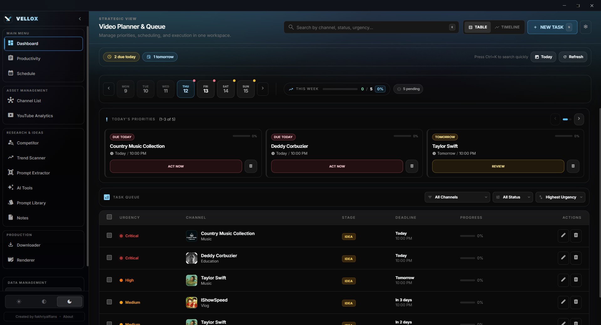

  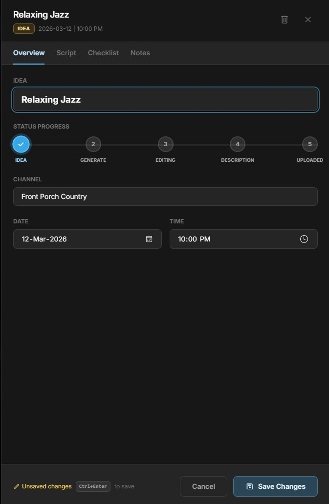

Pusat operasional utama untuk mengelola seluruh alur produksi video Anda.

- **Pipeline 7 Tahap**: Lacak setiap video melalui tahapan — *Ide → Scripting → Draft → Generate → Editing → Uploaded → Scheduled*
- **Kartu Prioritas Harian**: Tugas ditampilkan dengan indikator urgensi otomatis:
  - 🔴 **Overdue** — Sudah melewati deadline
  - 🟡 **Hari Ini** — Harus dikerjakan hari ini
  - 🔵 **Mendatang** — Tugas yang akan datang
- **Tabel Video Queue**: Seluruh tugas dalam format tabel yang bisa difilter, diurutkan, dan dicari. Kolom mencakup channel, tahap, deadline, dan progress
- **Ringkasan Harian Otomatis**: Modal yang muncul saat aplikasi dibuka, menampilkan breakdown tugas hari ini, item yang terlambat, dan streak motivasi
- **Auto-Schedule**: Otomatis membuat draft tugas kosong berdasarkan jadwal posting dan frekuensi upload setiap channel
- **Shortcut Keyboard**: `Ctrl+N` tugas baru, `Ctrl+K` pencarian, `Ctrl+Z` undo, `Ctrl+R` refresh

---

### 2. 📈 Analisis Produktivitas

  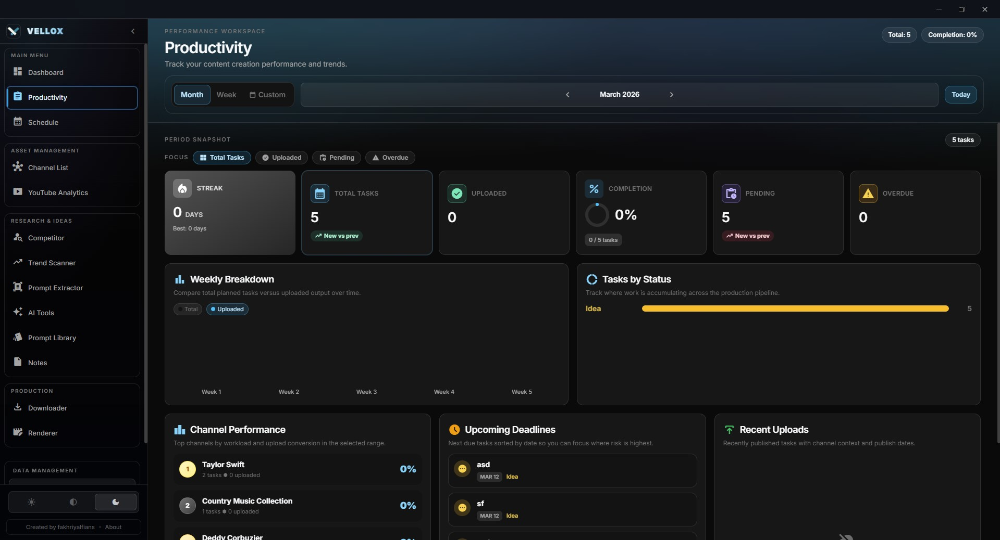

Pantau performa kerja Anda secara visual dari waktu ke waktu.

- **Breakdown Mingguan**: Grafik batang menampilkan jumlah tugas selesai per hari, lengkap dengan perbandingan minggu sebelumnya
- **Statistik Penyelesaian**: Total tugas, jumlah upload, tingkat penyelesaian, dan rata-rata tugas per minggu
- **Distribusi Status**: Visualisasi status tugas di seluruh tahap pipeline dengan segmen berwarna
- **Tracking Deadline**: Countdown deadline yang akan datang dengan indikator warna urgensi

---

### 3. 📅 Jadwal Mingguan

  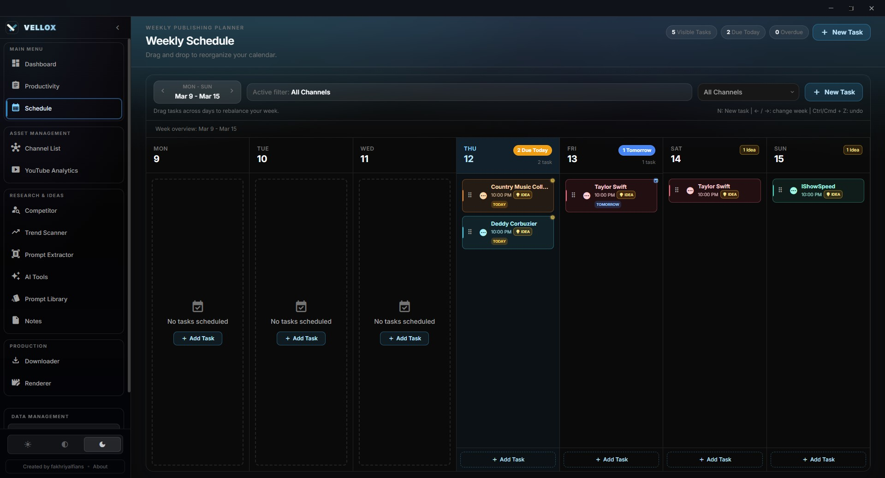

Tampilan kalender visual untuk merencanakan jadwal upload seluruh channel.

- **Grid Kalender 7 Hari**: Tampilan mingguan dengan slot waktu untuk setiap hari
- **Auto-Scheduling**: Buat draft tugas otomatis berdasarkan hari posting dan frekuensi setiap channel
- **Navigasi Tanggal**: Lompat ke hari ini, navigasi maju/mundur per minggu, dan date picker
- **Kode Warna per Channel**: Setiap channel mendapat warna unik untuk membedakan tugas secara visual

---

### 4. 📺 Manajemen Channel

  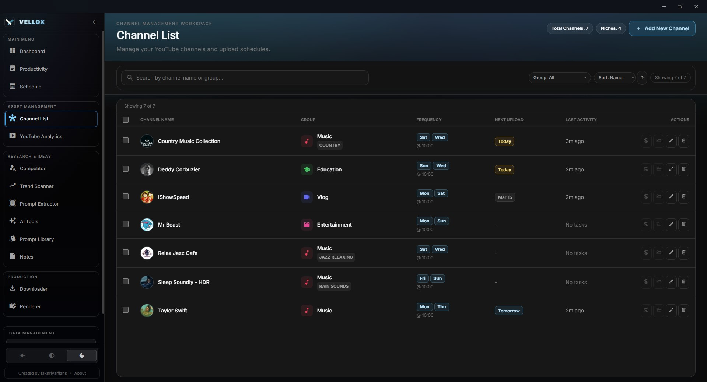

  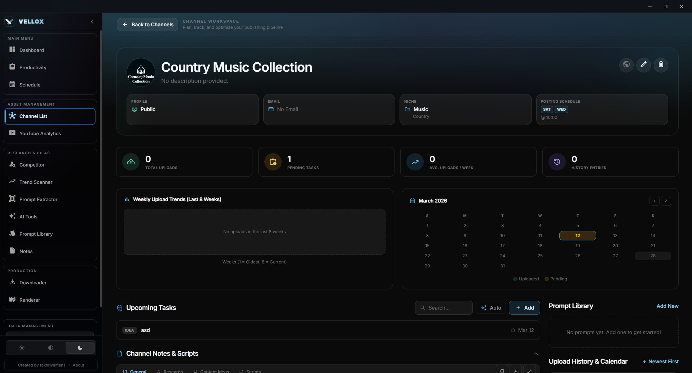

Kelola seluruh channel YouTube Anda dari satu dashboard terpusat.

- **Daftar Channel Tanpa Batas**: Tambahkan channel dengan avatar (otomatis diambil dari URL YouTube), kategori niche, jadwal posting, dan catatan khusus
- **Sorting & Filtering**: Urutkan berdasarkan nama, jumlah tugas, atau kategori; cari di seluruh channel
- **Halaman Detail Channel**: Setiap channel memiliki halaman khusus dengan tab Schedule, YouTube Analytics, dan Notes
- **Sistem Catatan per Channel**: Catatan rich-text yang terikat ke masing-masing channel — ideal untuk tracking sponsorship, ide konten, dan kontak
- **Folder Linking**: Hubungkan folder lokal di komputer Anda dengan setiap channel untuk akses cepat via integrasi native OS

---

### 5. 📊 YouTube Analytics

  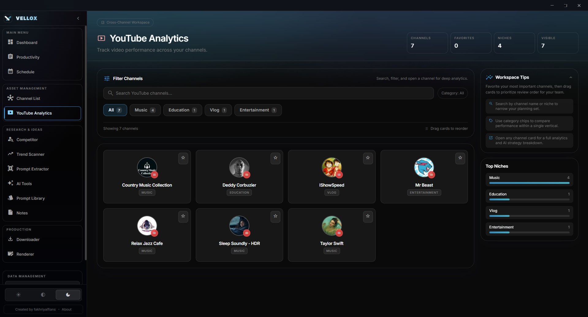

  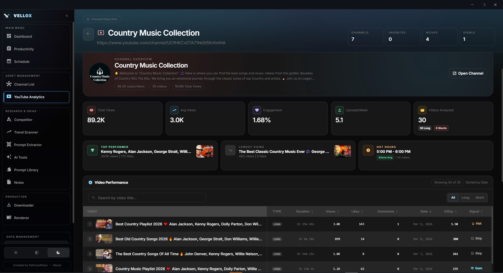

Analisis performa mendalam dan insight berbasis AI untuk channel Anda sendiri.

- **Pengambilan Data Video**: Scrape video terbaru dari channel Anda beserta jumlah views, likes, komentar, engagement rate, dan waktu publish
- **Metrik Performa**: Rata-rata views, engagement rate, upload per minggu, perbandingan Shorts vs. long-form
- **Deteksi Sinyal Konten**: Setiap video otomatis ditandai dengan label algoritmik:
  - 🔥 **Hot Topic** — Jangkauan tinggi dan engagement tinggi
  - 💎 **Hidden Gem** — Melebihi rata-rata baseline channel
  - 👀 **Clickbait** — Klik tinggi tapi engagement rendah
  - 💤 **Skip** — Performa di bawah rata-rata
- **AI Channel Insights**: Analisis AI satu-klik yang memeriksa video terbaik dan terburuk Anda, lalu menghasilkan rekomendasi strategi yang actionable
- **Riwayat Insights**: Semua insight AI tersimpan dalam sidebar library yang bisa dicari untuk referensi di kemudian hari

---

### 6. 🕵️ Riset Kompetitor

  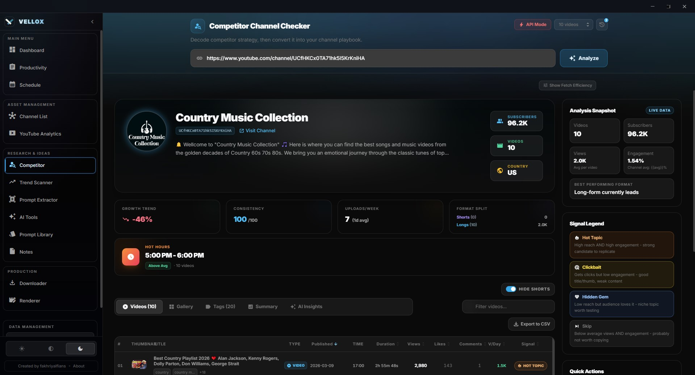

Modul intelijen kompetitor paling lengkap di seluruh aplikasi — analisis berbasis data untuk menemukan apa yang berhasil di niche Anda.

- **Deep Scraping via Rust**: Backend Rust melakukan scraping metadata lengkap dari channel YouTube manapun — **tanpa menghabiskan quota API resmi**. Mengambil video reguler dan Shorts dengan judul, views, likes, komentar, durasi, thumbnail, tag, dan deskripsi
- **Sorting Lanjutan**: Urutkan berdasarkan views, views-per-hari (V/Day), engagement rate, durasi, likes, komentar, atau tanggal publish — naik maupun turun
- **Engine Sinyal Konten**: Setiap video kompetitor langsung ditandai:
  - 🔥 **Hot Topic** — Kecepatan V/Day tinggi, kandidat kuat untuk direplikasi
  - 💎 **Hidden Gem** — Melebihi baseline channel, konten emas yang terabaikan
  - 👀 **Clickbait** — Impresi tinggi tapi engagement menurun
  - ⏭️ **Skip** — Jangkauan dan engagement di bawah rata-rata
- **AI Competitive Intelligence**: Insight AI berbasis data menggunakan Perplexity (data web langsung):
  - Pola konten pemenang & playbook judul
  - Intelijen format & analisis irama publikasi
  - Takeaways kompetitif yang actionable dengan sumber yang dikutip
- **Video Detail Drawer**: Klik video manapun untuk melihat panel slide-over dengan statistik detail, tag, deskripsi, metrik engagement, dan timestamp publish
- **Ekspor CSV**: Ekspor seluruh library video kompetitor ke CSV untuk analisis eksternal di Excel atau Google Sheets
- **Gallery View**: Galeri thumbnail visual dengan preview hover dan overlay sinyal — bisa beralih antara mode galeri dan mode tabel
- **Tab Summary**: Kartu profil channel dengan banner avatar glassmorphic, jumlah subscriber, total video, panel "Breakout Hits" (anomali matematis), dan analisis "Hot Hours" yang menunjukkan waktu posting optimal
- **Riwayat Pencarian**: Pencarian kompetitor terbaru tersimpan untuk akses cepat berulang

---

### 7. 📡 Trend Scanner

  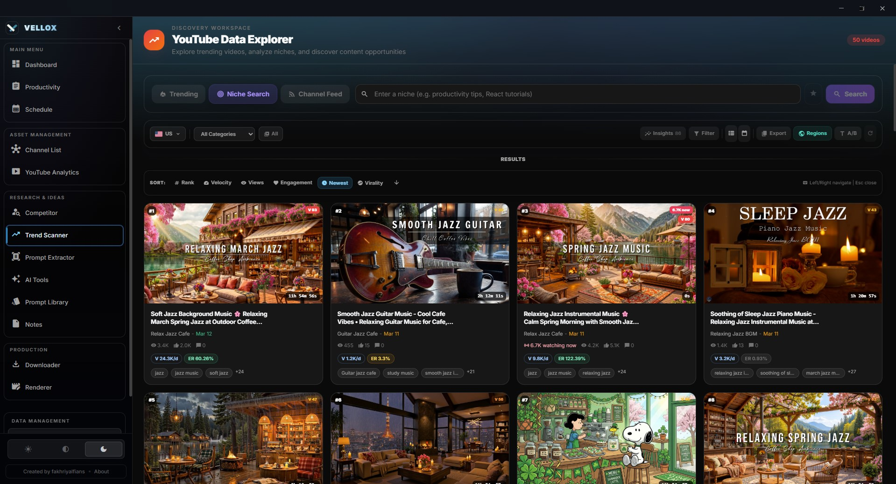

  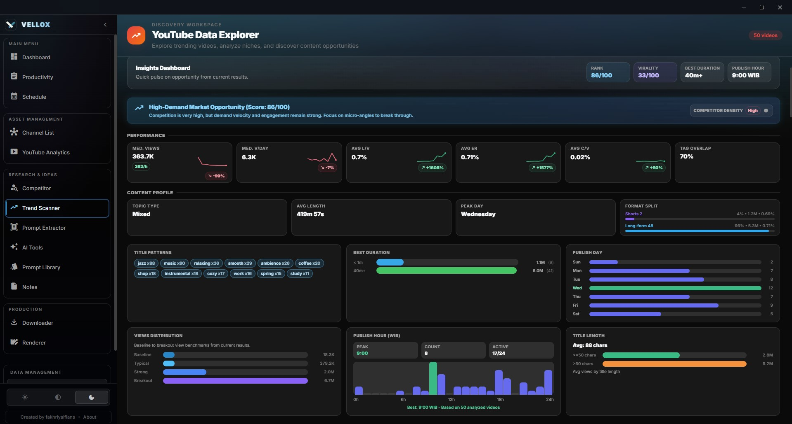

Modul terbesar dan paling canggih — dashboard analitik video Trending YouTube yang komprehensif.

- **Fetch Trending Real-Time**: Menarik hingga 200 video trending per wilayah menggunakan YouTube Data API, lengkap dengan metadata (views, likes, komentar, durasi, info channel, kategori, tag, deskripsi, dan timestamp)
- **48 Wilayah Didukung**: Ambil data trending dari 48 negara/wilayah berbeda
- **16 Filter Kategori**: Filter berdasarkan kategori resmi YouTube (Musik, Gaming, Hiburan, Sains & Teknologi, dll.)
- **Engine Skor Viralitas**: Setiap video mendapat skor viralitas komposit (0–100) yang menggabungkan:
  - Kecepatan views-per-hari
  - Rasio like & rasio komentar
  - Bobot kebaruan (recency)
- **Sistem Tier Performa**: Ranking berbasis persentil (Elite, Strong, Average, Below Average, New)
- **5 Mode Sorting**: Rank, Velocity (V/Day), Views, Newest, dan Virality — dengan toggle naik/turun
- **Filtering Lanjutan**: Cari berdasarkan judul/channel, filter berdasarkan tanggal upload (Hari Ini, 3 Hari Terakhir, Minggu Ini, Bulan Ini), filter berdasarkan bucket durasi (Pendek, Sedang, Panjang, Sangat Panjang), dan filter berdasarkan tier performa
- **Modal Perbandingan**: Pilih dan bandingkan hingga 12 video trending secara berdampingan dalam tabel metrik detail
- **Watchlist**: Simpan video trending yang menarik ke watchlist persistent
- **Pencarian Tersimpan**: Simpan konfigurasi filter kompleks untuk penggunaan ulang sekali klik

---

### 8. 🤖 AI Tools Suite

  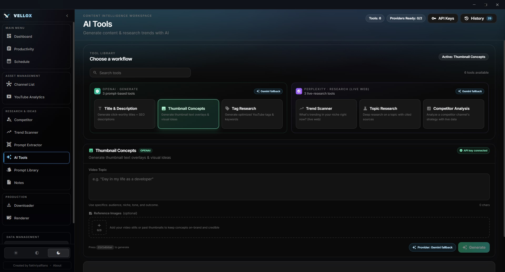

6 alat AI khusus untuk akselerasi pembuatan konten YouTube, masing-masing dengan system prompt yang direkayasa secara presisi.

#### Tools OpenAI (GPT-4o-mini):

| Alat | Fungsi |
|------|--------|
| **Judul & Deskripsi** | Generate 5 opsi judul CTR tinggi yang disesuaikan dengan niche Anda (Tech, Lifestyle, Gaming, Business, Education) + deskripsi SEO-optimized dengan hook, CTA, dan 5–15 hashtag tertarget |
| **Konsep Thumbnail** | 3 konsep thumbnail detail dengan prompt generasi gambar sinematik (250+ kata per prompt, kompatibel Midjourney/DALL-E/Flux), spesifikasi text overlay dengan blueprint tipografi pixel-precise, dan breakdown komposisi visual. Mendukung **upload gambar referensi** |
| **Riset Tag** | Tag primer, long-tail, trending, dan kompetitor yang diorganisir berdasarkan search intent — lengkap dengan string tag siap-paste |

#### Tools Perplexity (Sonar — Data Web Langsung):

| Alat | Fungsi |
|------|--------|
| **Trend Scanner** | Topik YouTube yang sedang trending dengan indikator popularitas (🟢/🟡/🔴), format yang sedang naik, 5 judul video siap pakai, dan snapshot niche — diperkaya data YouTube Trending API |
| **Riset Topik** | Analisis lanskap topik mendalam: 5 hook terbaik dengan level kompetisi, kreator top di topik tersebut, pain point audiens dari komentar/forum, dan riset keyword lengkap (10-15 keyword primer + 8-10 long-tail + 5-8 micro keyword dengan estimasi volume dan kompetisi) |
| **Analisis Kompetitor** | Breakdown strategi channel kompetitor secara langsung: strategi konten (top 3 kategori, pola judul, gaya thumbnail), analisis pertumbuhan, analisis breakout viral, assessment kekuatan & kelemahan, dan 3 strategi diferensiasi |

#### Fitur Bersama Semua AI Tools:

- **Konteks Channel**: Opsional, scope generasi AI ke channel tertentu untuk hasil yang lebih terarah
- **Pengayaan Data Trending**: AI Trend Scanner otomatis menyuntikkan data trending YouTube ke dalam prompt saat YouTube API key dikonfigurasi
- **Upload Gambar Referensi**: Tool Konsep Thumbnail mendukung drag-and-drop gambar referensi (hingga 3 gambar, maks 4MB per gambar)
- **Optimasi per-Tool**: Setiap tool menggunakan temperature yang disesuaikan (0.3 untuk presisi tag, 0.9 untuk kreativitas judul/thumbnail) dan limit token (2K–8K)
- **Bisa Dibatalkan**: Semua generasi AI bisa dibatalkan di tengah proses
- **Riwayat Generasi**: Semua output AI tersimpan lokal dengan konteks lengkap — bisa dicari dan difilter di drawer riwayat
- **Undo**: Item riwayat yang dihapus bisa dipulihkan via `Ctrl+Z`

---

### 9. 🖼️ Prompt Extractor

  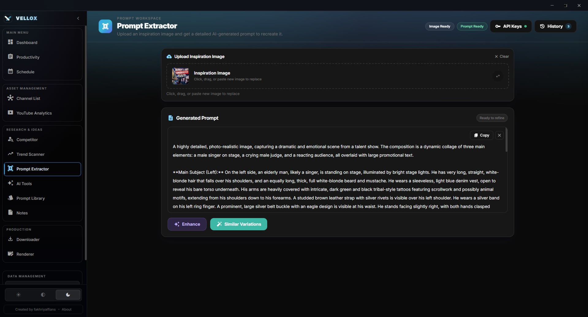

Ekstrak dan generate prompt gambar dari gambar referensi menggunakan Google Gemini AI.

- **Image → Prompt**: Upload gambar apa saja (drag & drop, paste dari clipboard, atau file picker) dan Gemini akan menghasilkan prompt rekonstruksi detail yang cocok untuk Midjourney, DALL-E, Stable Diffusion, dan generator gambar lainnya
- **Prompt Enhancement**: Satu klik "magic enhance" yang memperkaya prompt dengan detail vivid tentang pencahayaan, atmosfer, tekstur, komposisi, kualitas sinematik, dan spesifikasi rendering
- **Variasi**: Generate 3 variasi subjek yang berbeda sambil mempertahankan style, mood, dan estetika aslinya — setiap variasi bisa dipilih dan disalin
- **Riwayat Prompt**: Semua prompt tersimpan lokal dengan thumbnail terkompresi, langsung bisa diakses kembali
- **Kompresi Otomatis**: Pipeline kompresi multi-pass otomatis untuk menjaga file dalam batas 4MB Gemini
- **Copy Sekali Klik**: Salin prompt atau variasi apa saja langsung ke clipboard

---

### 10. 📝 Catatan & Notes

  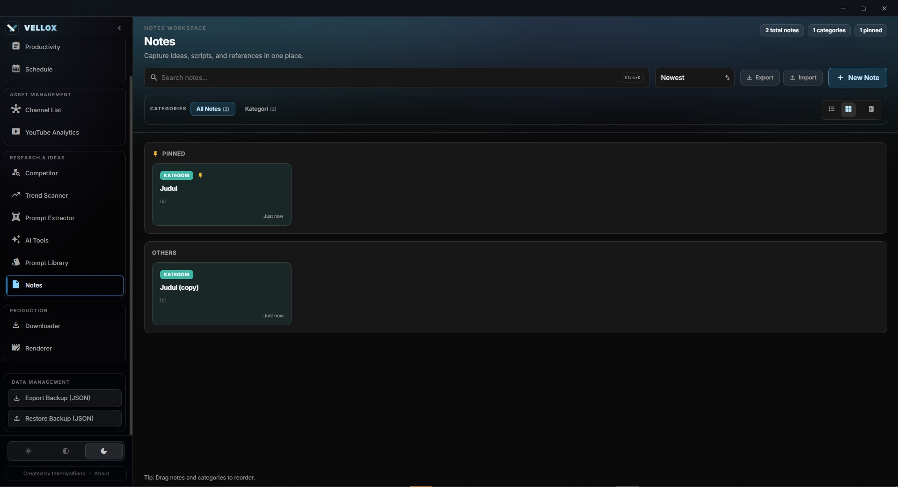

Sistem catatan lengkap untuk mengorganisir ide konten dan pengetahuan produksi Anda.

- **Rich Text Editor**: Bold, italic, underline, strikethrough, heading (H1-H3), bullet list, numbered list, code block, blockquote, horizontal rule, dan penyisipan gambar
- **Tampilan Grid & List**: Beralih antara grid kartu visual (menampilkan preview) dan tampilan list padat
- **Kategori & Warna**: Tetapkan kategori custom, tag warna, dan ikon ke setiap catatan
- **Scope per Channel**: Hubungkan catatan ke channel tertentu untuk perencanaan konten terorganisir per brand
- **Pencarian**: Full-text search di seluruh catatan dengan shortcut `Ctrl+K`
- **Favorit & Sorting**: Pin catatan penting, urutkan berdasarkan terbaru, terlama, atau alfabet
- **Soft Delete & Trash**: Catatan yang dihapus masuk ke tempat sampah dengan kemampuan restore — tidak ada yang hilang permanen sampai Anda mengosongkan trash secara eksplisit
- **Export & Import**: Backup catatan sebagai JSON untuk portabilitas antar perangkat
- **Drag-and-Drop Reordering**: Penyusunan custom dengan drag-and-drop berbasis physics

---

### 11. 📥 Downloader Video & Audio

  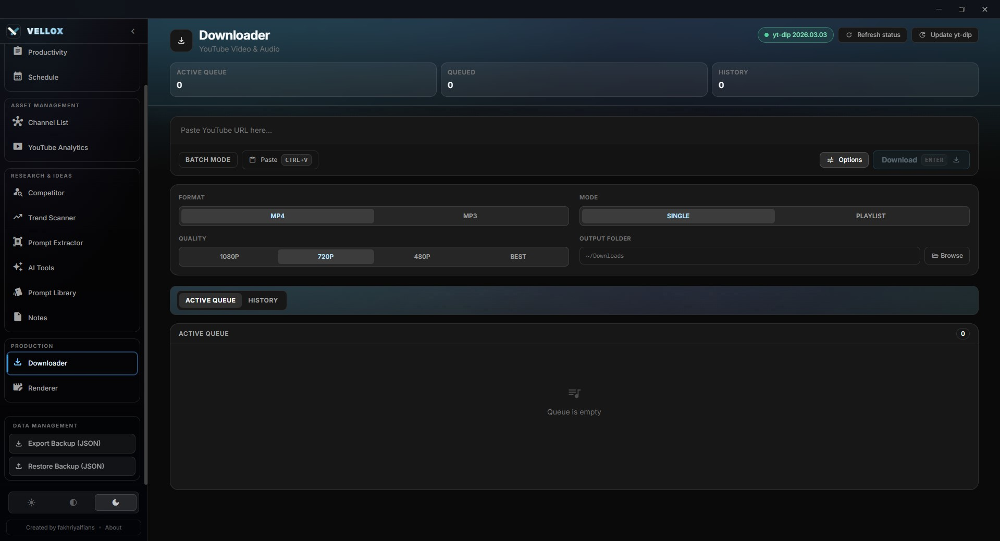

Download konten YouTube secara native melalui backend Rust tanpa tools atau website eksternal.

- **Download Video & Audio**: Download video YouTube apa saja (hingga 4K) atau ekstrak stream audio-only dengan pemilihan kualitas
- **Progress Real-Time**: Update progress real-time yang di-parse dari yt-dlp — menampilkan persentase, kecepatan download, ukuran file, dan waktu elapsed
- **Preview Info Video**: Ambil metadata video (judul, durasi, thumbnail, format tersedia) sebelum download
- **Auto-Quality**: Otomatis memilih kualitas terbaik saat "Best" dipilih
- **Antrian Download**: Queue beberapa download bersamaan dengan tombol cancel individual dan tracking status
- **Riwayat Download**: Riwayat persistent seluruh download yang selesai dengan opsi re-download, buka folder, dan hapus
- **Download Thumbnail**: Download thumbnail video secara langsung
- **Direktori Output Custom**: Konfigurasi lokasi penyimpanan file download
- **Auto-Update yt-dlp**: Perintah built-in untuk update yt-dlp ke versi terkini

---

### 12. 🎬 Video Renderer

  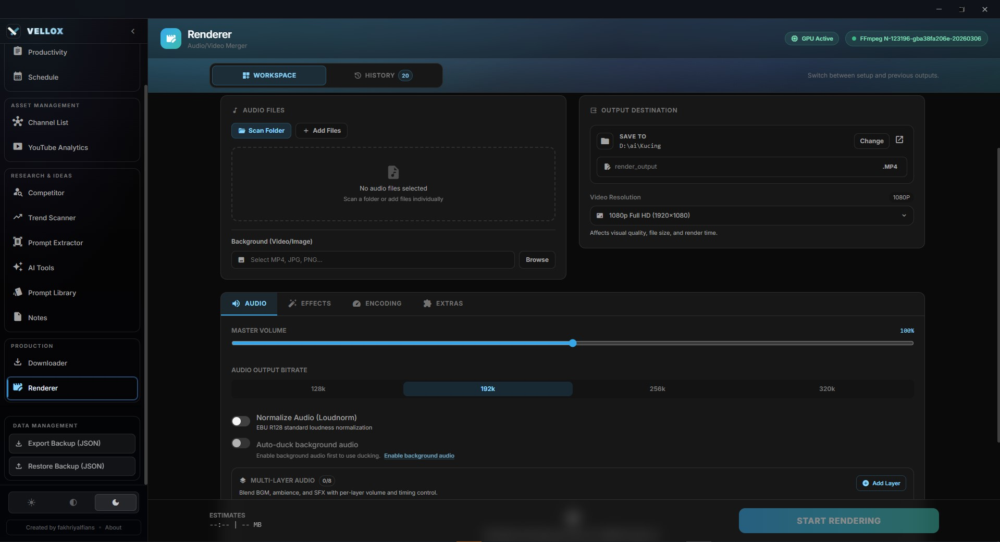

Pipeline kompilasi dan rendering video yang sepenuhnya customizable, ditenagai oleh FFmpeg dan dikontrol melalui backend Rust.

- **Drag-and-Drop Assembly**: Tambahkan video background dan tumpuk beberapa track audio voiceover/musik dengan drag-and-drop reordering
- **Akselerasi GPU Hardware**: Backend Rust otomatis mendeteksi GPU Anda dan memilih encoder optimal:
  - `NVENC` — GPU NVIDIA
  - `AMF` — GPU AMD
  - `QSV` — Intel QuickSync
  - Fallback ke `libx264` software encoding
- **Preset Resolusi**: 480p, 720p, 1080p, atau 4K
- **Preset Render**: Konfigurasi kualitas pre-set yang mengoptimalkan tradeoff bitrate/kualitas/kecepatan
- **Efek Video**: Fade-in, fade-out, video reversing, normalisasi volume, dan looping audio background — **tanpa perlu membuka Premiere Pro**
- **Injeksi Intro/Outro**: Sambung klip intro dan outro ke video kompilasi secara seamless
- **Mixing ASMR**: Layer ambience independen (hujan, ombak, jangkrik) dengan volume per-layer dan ducking opsional
- **Efek Visual**: Overlay partikel, glitch pass, dan overlay spektrum audio dengan opacity yang bisa dikonfigurasi
- **Progress Presisi**: Parsing frame FFmpeg real-time untuk kecepatan encoding (fps), progress timestamp, waktu elapsed, dan ETA akurat
- **Estimasi Ukuran File**: Estimasi ukuran file sebelum render berdasarkan resolusi, bitrate, dan durasi
- **Scan Folder Audio**: Scan folder dan auto-import semua file audio sebagai track
- **Media Info**: Informasi detail media (codec, resolusi, durasi, bitrate) untuk file apa saja via `ffprobe`
- **Riwayat Render**: Semua render yang selesai dengan path file, durasi, dan metadata
- **Generasi Timestamp**: Auto-generate file `.txt` timestamp/chapter berdasarkan posisi splice audio — siap untuk chapter marker YouTube
- **Cancel Support**: Batalkan render aktif di tengah proses

---

### 13. 🔒 Prompt Library

Simpan dan organisir prompt AI paling sukses Anda untuk penggunaan ulang cepat.

- **Organisasi per Kategori**: Kelompokkan prompt berdasarkan kategori dengan ikon dan warna custom
- **Scope per Channel**: Hubungkan prompt ke channel tertentu
- **Rendering Markdown**: Dukungan markdown penuh dalam konten prompt
- **Drag-and-Drop Reordering**: Penyusunan custom dalam kategori
- **Quick Copy**: Salin ke clipboard sekali klik untuk penggunaan cepat

---

## 🔐 Privasi & Keamanan Data

Vellox adalah aplikasi **local-first**. Data Anda **tidak pernah meninggalkan komputer Anda**.

| Prinsip | Detail |
|---------|--------|
| **Tanpa database cloud** | Semua data — tugas, catatan, prompt, pengaturan — tersimpan di localStorage/JSON di komputer Anda |
| **Tanpa telemetri** | Nol tracking, nol pengumpulan analitik, nol ping ke server eksternal |
| **Tanpa akun pengguna** | Tidak ada registrasi, tidak ada login, tidak ada cloud sync — buka aplikasi dan langsung bekerja |
| **Keamanan API key** | Key disimpan lokal dan hanya dikirim langsung ke endpoint API resmi (OpenAI, Perplexity, Google Gemini, YouTube Data API) |
| **Sistem auto-backup** | Backup otomatis saat startup, setiap 2 jam, dan saat aplikasi ditutup — dengan one-click restore |
| **Integrity checking** | Verifikasi hash SHA-256 untuk binary yang didownload (ffmpeg, yt-dlp) |

---

## 🛠️ Spesifikasi Teknis

| Aspek | Detail |
|-------|--------|
| **Ukuran Installer** | ~12 MB |
| **Ukuran Bundle JS** | ~430 KB (gzipped) |
| **OS** | Windows 10/11 (64-bit) |
| **Framework** | Tauri v2 (Rust backend) + React 19 + TypeScript |
| **Konsumsi RAM** | ~80–150 MB Idle|
| **Bahasa** | Indonesia 🇮🇩 & English 🇺🇸 (1.500+ kunci terjemahan) |
| **AI Provider** | OpenAI (GPT-4o-mini), Perplexity (Sonar), Google Gemini (2.5 Flash) |
| **Binary Tools** | FFmpeg, FFprobe, yt-dlp (auto-download saat pertama kali) |
| **IPC Commands** | 32 perintah Rust di 7 modul |
| **Views** | 14 halaman lazy-loaded (code-split) |
| **Komponen** | 46+ komponen UI yang reusable |
| **Desain** | Hyper-Minimalist OLED dark aesthetic dengan glassmorphic panels |

---

## 🎯 Siapa yang Cocok Menggunakan Vellox?

### YouTube Creator Solo
Anda mengelola 1–5 channel sendiri dan perlu satu tempat untuk melacak jadwal, riset ide, dan menghasilkan konten secara konsisten. Vellox menggantikan spreadsheet, browser tab, dan app terpisah menjadi satu workspace.

### Tim Konten / Agency Kecil
Tim kecil yang mengelola beberapa channel brand membutuhkan alat terstruktur untuk pipeline produksi, riset kompetitor, dan kolaborasi catatan — tanpa biaya langganan per-user yang mahal.

### Video Editor Freelance
Anda sering mengerjakan proyek video untuk berbagai client. Vellox menyederhanakan proses download aset, render kompilasi, dan mengorganisir prompt/catatan per-proyek.

### Content Strategist
Anda perlu menganalisis tren, memantau kompetitor, dan menghasilkan insight berdasarkan data — semua dari satu dashboard yang cepat dan privat.

---

## ⚖️ Perbandingan dengan Alternatif Lain

| Fitur | Vellox | TubeBuddy | vidIQ | Notion + ChatGPT |
|-------|--------|-----------|-------|-------------------|
| Pipeline produksi video | ✅ 7 tahap | ❌ | ❌ | ⚠️ Manual setup |
| Scraping kompetitor tanpa API limit | ✅ | ❌ | ❌ | ❌ |
| Trend scanner 48 negara | ✅ | ❌ | ⚠️ Terbatas | ❌ |
| AI tools khusus YouTube | ✅ 6 tools | ⚠️ Terbatas | ⚠️ Terbatas | ⚠️ Prompt manual |
| Download video/audio built-in | ✅ Hingga 4K | ❌ | ❌ | ❌ |
| Video renderer terintegrasi | ✅ GPU-accelerated | ❌ | ❌ | ❌ |
| 100% offline & privat | ✅ | ❌ Browser ext. | ❌ Browser ext. | ❌ Cloud-based |
| Sekali bayar | ✅ | ❌ Langganan | ❌ Langganan | ❌ Langganan |
| Desktop native (bukan Electron) | ✅ Tauri/Rust | ❌ | ❌ | ❌ |
| Bahasa Indonesia | ✅ Lengkap | ❌ | ❌ | ⚠️ Tergantung prompt |

---

## 💰 Lisensi & Harga

### Model Lisensi: Sekali Bayar (Lifetime)

| Paket | Harga | Keterangan |
|-------|-------|------------|
| **Lisensi Personal** | Rp 250.000 | 1 perangkat, update gratis selamanya |

> **Catatan**: Anda perlu menyediakan API key sendiri untuk fitur AI (OpenAI, Perplexity, Google Gemini) dan YouTube Data API. Vellox tidak menyediakan API key — ini menjamin privasi dan kontrol penuh atas penggunaan API Anda.

### Apa yang Anda Dapatkan:
- ✅ Aplikasi desktop Vellox versi terbaru
- ✅ Seluruh fitur tanpa batasan (tidak ada tiering fitur)
- ✅ Update gratis selamanya
- ✅ Auto-download binary tools (FFmpeg, yt-dlp) pada peluncuran pertama
- ✅ Dukungan teknis via kontak developer

### Aktivasi:
- Lisensi diaktifkan secara offline menggunakan kunci lisensi unik
- Tidak memerlukan koneksi internet untuk validasi setelah aktivasi
- Satu kunci untuk satu perangkat

---

## ❓ FAQ

**Q: Apakah saya perlu koneksi internet untuk menggunakan Vellox?**
A: Tidak untuk fitur inti (pipeline, catatan, prompt library, renderer). Koneksi internet hanya diperlukan untuk fitur yang memang membutuhkan data online: AI tools (mengakses API OpenAI/Perplexity/Gemini), Trend Scanner (mengakses YouTube Data API), Riset Kompetitor (scraping YouTube), dan Downloader (download video).

**Q: Apakah Vellox aman untuk data saya?**
A: Ya. Seluruh data disimpan di komputer Anda (localStorage). Tidak ada server cloud, tidak ada telemetri, tidak ada akun. API key Anda hanya dikirim ke endpoint resmi masing-masing provider.

**Q: Apakah saya perlu membeli API key terpisah?**
A: Ya. Vellox mengintegrasikan API dari OpenAI, Perplexity, Google Gemini, dan YouTube Data API. Anda perlu mendaftarkan dan mendapatkan API key sendiri dari masing-masing provider. Ini menjamin kontrol penuh dan transparansi atas biaya penggunaan API Anda.

**Q: OS apa yang didukung?**
A: Saat ini Vellox mendukung **Windows 10/11 (64-bit)**.

**Q: Bagaimana dengan update?**
A: Vellox memiliki sistem auto-updater bawaan. Saat versi baru tersedia, banner akan muncul di dalam aplikasi dan Anda bisa update dengan satu klik. Update gratis selamanya.

**Q: Apakah ffmpeg/yt-dlp sudah termasuk?**
A: Ya. Saat pertama kali membuka Vellox, aplikasi akan otomatis mendownload `ffmpeg`, `ffprobe`, dan `yt-dlp` dari rilis resmi GitHub, lengkap dengan verifikasi SHA-256. Anda tidak perlu menginstall apa pun secara manual.

**Q: Berapa RAM yang dibutuhkan?**
A: Vellox menggunakan ~80–150 MB RAM dalam penggunaan normal 

**Q: Apakah bisa digunakan untuk banyak channel?**
A: Ya. Anda bisa menambahkan channel tanpa batas, masing-masing dengan jadwal, catatan, dan pengaturan terpisah.

---

## 🤝 Kontak & Dukungan

Dibuat oleh **Fakhriyalfians**.

💬 Punya pertanyaan atau butuh bantuan?
- 📸 [Instagram](https://www.instagram.com/fakhriyalfians/)
- 📘 [Facebook](https://www.facebook.com/faczry167/)
- [SociaBuzz](https://sociabuzz.com/fakhriyalfians/tribe)

---

  <strong>Vellox</strong> — Berhenti berpindah antar tab. Mulai berkreasi. 
  <em>Satu app. Seluruh workflow. Selamanya milik Anda.</em>

