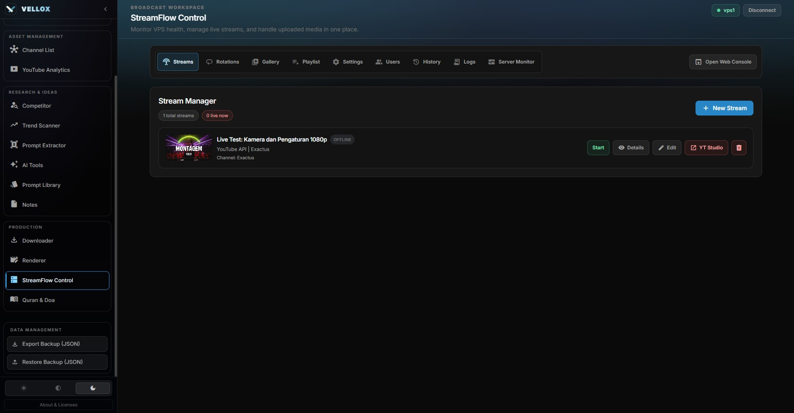
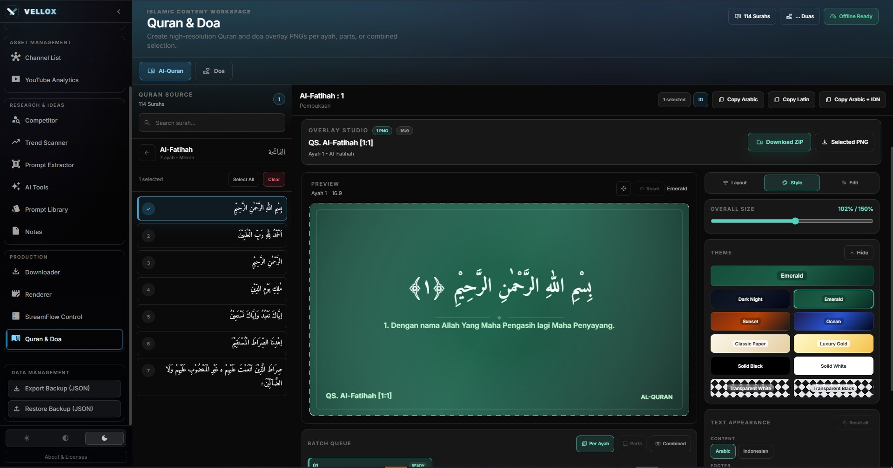

<h1 align="center">Vellox</h1>

  <strong>One Desktop App. All Your YouTube Content Needs.</strong> 
  Research · Analysis · AI · Download · Render · Live Stream — All in One Place.

  

  
  
  

---

[🇮🇩 Baca dalam Bahasa Indonesia (Read in Indonesian)](README.md)

---

## Table of Contents

- [What is Vellox?](#-what-is-vellox)
- [Why Vellox?](#-why-vellox)
- [Complete Features](#-complete-features)
  - [Dashboard & Pipeline](#1--dashboard--production-pipeline)
  - [Productivity Analytics](#2--productivity-analytics)
  - [Weekly Schedule](#3--weekly-schedule)
  - [Channel Management](#4--channel-management)
  - [YouTube Analytics](#5--youtube-analytics)
  - [Competitor Research](#6-️-competitor-research)
  - [Trend Scanner](#7--trend-scanner)
  - [AI Tools Suite](#8--ai-tools-suite)
  - [Prompt Extractor](#9-️-prompt-extractor)
  - [Catatan & Notes](#10--notes--memos)
  - [Video & Audio Downloader](#11--video--audio-downloader)
  - [Video Renderer](#12--video-renderer)
  - [Prompt Library](#13--prompt-library)
  - [StreamFlow Control](#14--streamflow-control)
  - [Quran & Doa Overlay](#15--quran--doa-overlay)
- [Privacy & Data Security](#-privacy--data-security)
- [Technical Specifications](#-technical-specifications)
- [Who is Vellox For?](#-who-is-vellox-for)
- [Comparison with Alternatives](#-comparison-with-alternatives)
- [License & Pricing](#-license--pricing)
- [FAQ](#-faq)
- [Vellox Credits](#-vellox-credits)
- [StreamFlow Credits](#-streamflow-credits)
- [Contact & Support](#-contact--support)

---

## 📖 What is Vellox?

**Vellox** is an all-in-one desktop application designed specifically for **YouTube creators**, **channel managers**, and **video editors**. Vellox combines all the tools that are usually scattered across various websites, apps, and browser tabs — into **one unified workspace** running completely on your computer.

No user accounts required. No monthly subscriptions. No internet connection needed for core features. **Buy once, own it forever.**

### What Can You Do with Vellox?

| Need | Vellox Solution |
|-----------|-----------------|
| Track video progress from idea to upload | ✅ 7-stage pipeline + weekly calendar |
| Research and analyze competitor channels | ✅ Deep scraping with no API quota limits |
| Track current YouTube trends | ✅ Trending data from 48 countries + virality score |
| Check monetization signals for trending videos | ✅ Monetization badges + background scan/local cache |
| Craft optimal titles, descriptions, and tags | ✅ 6 dedicated YouTube AI tools (OpenAI + Perplexity + Gemini) |
| Download YouTube video/audio | ✅ Built-in downloader up to 4K |
| Render/stitch videos | ✅ Integrated FFmpeg with GPU acceleration |
| Control automated live streams | ✅ StreamFlow Control for streams, playlists, rotations, uploads, and VPS runtime |
| Create ready-to-edit verse/doa overlays | ✅ High-resolution Quran & Doa Overlay PNGs with per-ayah/parts/combined modes |
| Store AI prompts and notes | ✅ Per-channel Notes & Prompt Library |

---

## 💡 Why Vellox?

### 1. Everything in One Place
No more switching between spreadsheets, browsers, ChatGPT, downloader sites, and editing software. Vellox unifies the **entire YouTube content creation workflow** within a single application window.

### 2. 100% Offline & Private
All of your data — tasks, notes, history, settings — is stored **only on your computer**. There are no cloud servers, no telemetry, no tracking. Your API keys are strictly sent directly to official endpoints (OpenAI/Perplexity/Gemini/YouTube).

### 3. Native Desktop Performance
Built with **Tauri v2 (Rust)** — which means Vellox requires a **much smaller memory footprint**, has faster startup times, and doesn't drag down your system. Total JavaScript bundle size is only **~430 KB** (gzipped).

### 4. Pay Once, Keep Forever
No subscription fees. Buy it once, use it forever. Free updates included.

### 5. Full Bilingual Support
The entire interface natively supports both **English** and **Indonesian** with over 1,500+ translation keys, automatically following your operating system's language setting.

### 6. Ready for Live Streams & Islamic Content
In addition to regular video workflows, Vellox assists creators who run **automated live streams** and Islamic content. StreamFlow Control connects the Vellox desktop to your live stream worker/VPS, while Quran & Doa Overlay generates ready-to-use PNG assets for verses and prayers for videos or broadcasts.

---

## 🚀 Complete Features

### 1. 📊 Dashboard & Production Pipeline

  

  

The main command center to manage your entire video production workflow.

- **7-Stage Pipeline**: Track every video through custom stages — *Idea → Scripting → Draft → Generate → Editing → Uploaded → Scheduled*
- **Daily Priority Cards**: Tasks are styled with automatic urgency indicators:
  - 🔴 **Overdue** — Passed the deadline
  - 🟡 **Today** — Due today
  - 🔵 **Upcoming** — Future tasks
- **Video Queue Table**: All your active tasks formatted in a sortable, filterable, and searchable table layout. Columns list channels, project stages, deadlines, and tracking progress
- **Automated Daily Summary**: A popup modal available on startup breaking down today’s required tasks, overdue items, and motivational streaks
- **Auto-Schedule**: Easily auto-generate blank tasks according to each channel's preset frequency and posting schedule
- **Keyboard Shortcuts**: Use `Ctrl+N` for new tasks, `Ctrl+K` for search, `Ctrl+Z` to undo, and `Ctrl+R` to refresh

---

### 2. 📈 Productivity Analytics

  

Monitor your work performance visually over time.

- **Weekly Breakdown**: A bar chart demonstrating completed tasks daily, paired with comparisons to your previous week
- **Completion Statistics**: Visual metrics covering total tasks, upload count, task completion rates, and average tasks handled per week
- **Status Distribution**: Check current job distribution across all pipeline stages via color-coordinated segments
- **Deadline Tracking**: Real-time countdowns for approaching deadlines utilizing urgency color-coding

---

### 3. 📅 Weekly Schedule

  

A visual calendar interface planning out global upload schedules for all connected channels.

- **7-Day Calendar Grid**: A weekly viewing template displaying available slots daily
- **Auto-Scheduling**: Automatically craft placeholder tasks leveraging defined posting days for chosen channels
- **Date Navigation**: Easily jump backward/forward by week, select specific target days, or return to 'today' instantly
- **Per-Channel Color Coding**: Each added channel adopts a customized visual key identifying tasks smoothly

---

### 4. 📺 Channel Management

  

  

Organize and coordinate all YouTube channels centrally.

- **Unlimited Channel Roster**: Add countless channels pulling avatars automatically from active YouTube URLs, selecting custom niche classes, establishing core posting schedules, and retaining specific data parameters
- **Sorting & Filtering**: Find targeted channel profiles fast by filtering alphabetically, task frequency, or category filters
- **Detail Pages per Channel**: Exclusive focus views for connected channels tracking granular schedules, independent YouTube analytics, and dedicated workspace memos
- **Bespoke Notes Feature**: Access robust rich-text notes uniquely bound to chosen channels—perfect for compiling sponsorship details, raw content concepts, or direct contact sheets
- **Local Folder Linking**: Attach local system storage locations directly to corresponding channel pages for quick native OS navigation access

---

### 5. 📊 YouTube Analytics

  

  

In-depth localized performance analytics supported by intelligent AI-powered evaluation metrics covering personal channel statistics.

- **Automated Video Extraction**: Scrape recently published content directly tracing current view counts, upvotes, total comments, granular engagement percentages, and publishing times
- **Performance Key Identifiers**: Breakdown average views, dynamic engagement rates, standard weekly output counts, and view comparisons covering long-form releases VS Shorts
- **Automated Intelligence Signaling**: Every documented video carries programmatic success labels highlighting traits like:
  - 🔥 **Hot Topic** — Above-average audience retention paired with extreme raw views
  - 💎 **Hidden Gem** — Strong baseline performances ignored traditionally
  - 👀 **Clickbait** — Click-dense results hindered by drastically poor engagement
  - 💤 **Skip** — Subpar outputs testing underneath current average requirements
- **Actionable AI Channel Insights**: Generate singular click insights leveraging API tools to deconstruct best/worst uploads leading to strategic recommendations intended for actionable growth methodologies
- **Searchable Insight Archives**: Consistently store critical AI intelligence reviews locally accessible directly via sidebars structured for easy future reference checking

---

### 6. 🕵️ Competitor Research

  

The most expansive competitor discovery suite — deeply analytical tools locating successful engagement blueprints operating directly in your niche.

- **API-less Rust Scraping**: Localized Rust backend instances process detailed YouTube metrology covering competing channel lists completely devoid of restricted API limitations. Grabs regular video/Short data referencing global stats like total view counts, active tags, thumb imagery, publishing timestamps, duration structures, and description documentation
- **Advanced Parameter Sorting**: Readjust fetched metrics targeting exact specifics via sorting drop-downs adjusting fields like views-per-day velocity metrics, total active comments, or localized engagement percentages mapping content linearly 
- **Active Signal Engine**: Real-time competitor tracking stamps extracted data automatically featuring labels like:
  - 🔥 **Hot Topic** — Impressive view velocity marks showing clear rapid popularity
  - 💎 **Hidden Gem** — Content significantly outperforming normal channel baselines
  - 👀 **Clickbait** — Rapid views masking low audience satisfaction metrics
  - ⏭️ **Skip** — Overall engagements dropping completely below standard thresholds
- **Web-Data Competitive Intelligence Algorithms**: Leverage live net data parsing specific competitor intelligence methodologies specifically extracting:
  - Proven tactical plays targeting winning concepts and title layouts
  - Cadence checks identifying standard video formats alongside normal release windows
  - Competitive strategic feedback points backed with sourced internet findings
- **Detailed Drawer Navigation**: Select singular tracking video to unfold overlay panels carrying granular structural tags, exact duration counts, full transcript details, matching comment quantities, and raw data timestamps
- **CSV Output Support**: Render offline library dumps porting directly to usable Excel spreadsheet layouts focusing directly on long-form statistical research off-app 
- **Dual Visual Viewing Templates**: Shift between standard analytical column table designs and dynamic visual gallery boards supporting quick visual assessments highlighting key thumb designs 
- **Comprehensive Summary Tab Layouts**: Inspect total subscriber records quickly against total content databases scanning specific "Breakout Hit" profiles scanning "Hot Hour" publishing anomalies finding the prime window to attack target niches
- **Saved Custom Search Rules**: Ensure repeatable success saving custom filter checks for complex parameters utilizing one simple click operation

---

### 7. 📡 Trend Scanner

  

  

Our most comprehensive data scanner feature providing an integrated view detailing localized YouTube trending structures natively inside the workspace.

- **Real-Time Data Integration Fetching**: Pull upwards of 200 real-time YouTube trending results sorting natively across distinct regional spaces directly connecting full metadata parameters utilizing pure API endpoints accessing title, channel location, localized tag profiles, descriptions, timestamps, and deep category groupings 
- **48 Unified Geo-Regions Supported**: Connect and search globally active lists checking data variables spanning up to 48 independent areas/regions globally
- **Categorical Breakdown Integration**: Funnel specific data points identifying categories actively approved directly under YouTube algorithms matching Music, Gaming, Technology, and similar profiles  
- **Internal Virality Scaling Matrix**: Each specific entry undergoes dedicated algorithmic grading matrices spanning between 0 to 100 processing internal weights analyzing:
  - True-view tracking velocity scores per day
  - Specific like comparisons against comment ratios checking direct interaction
  - Content release timelines ensuring recency biases rank correctly
- **Progressive Performace Scaling Classifications**: Implement visual rankings showing absolute data placements classifying entries using Elite, Strong, Standard, Underperforming, or Entry titles
- **5 Granular Sorting Patterns**: Rank metrics by Velocity calculations tracking active daily scores tracking overall true placements checking total active views against brand new entries checking full internal Virality computations manipulating descending and ascending data checks  
- **Multi-Factor Filter Tracing**: Hunt specifics tracking channels directly via exact title references locating upload times crossing Today, Past 3 Days, and full monthly tracking separating options down to total video timing categorizations capturing Shorts up until deep long-form analysis checking all relative baseline scores
- **Monetization Signal Detection**: Check public monetization signals for trending videos and display **Monetized** or **No Signal** badges directly in the grid/list
- **Auto Monetization Scan**: Currently visible videos can be automatically scanned in the background, with local caching to prevent redundant data fetching
- **Compare Module Overlay**: Examine detailed specifics visually assessing up to 12 target clips stacked parallel examining cross-metric points perfectly against each other instantly capturing exact statistical weaknesses in competition files 
- **Persistent Local View Tracking**: Attach key videos matching target parameters towards accessible watchlist queues updating persistently across login sessions saving specific points for follow up review tracking 
- **Data Save State System**: Eliminate constant configuration setups retaining custom advanced filter requirements accessing critical data instantly whenever required 

---

### 8. 🤖 AI Tools Suite

  

6 deeply specialized internal tools optimizing precise YouTube creation needs scaling development windows leveraging strictly tuned system prompts structured natively behind the scenes.

#### OpenAI Systems (GPT-4o-mini):

| Application | Process Focus |
|------|--------|
| **Titles & Descriptive Fields** | Iterates 5 premium CTR-focused titles explicitly designed mapping across targeted spaces identifying specific niche elements creating deeply structured SEO fields merging hook mechanics, interactive calls to action, appending 5 to 15 correctly paired tags |
| **Thumb Ideation Construction** | Processes 3 explicitly engineered design specifications producing high-grade cinematic visual instructions supporting third-party diffusion architectures mapping Midjourney elements directly alongside visual placement formatting breaking down precise typography structures paired effectively accepting **direct image reference importing** |
| **Comprehensive Keyword Architectures** | Locates high-target tracking intents compiling root tags spanning out connecting direct competitor usage mapping directly alongside trending terms generating immediate ready-to-copy string files built specifically around primary SEO ranking guidelines |

#### Perplexity Engine Tools (Sonar — Live Environment Polling):

| Application | Process Focus |
|------|--------|
| **Trending Topic Indexing** | Scans live-state YouTube conditions identifying immediate popularity structures (🟢/🟡/🔴) discovering rising templates locating 5 immediate title variations establishing general overviews connecting live API returns validating the entire prompt directly |
| **Deep Content Discovery** | Examines topic ecosystems creating fundamental layout designs generating highly targeted hook segments analyzing parallel competition spaces finding exact user complaints inside community sectors developing comprehensive keyword grids listing precise 10-15 primary targets accompanied tightly by 8-10 longer queries attaching 5-8 hyper-focused terms factoring exact search density tracking metrics against absolute competition spaces |
| **True Threat Analysis Profiling** | Breaks fundamental channel strategies examining overarching design formats listing primary 3 focus groups decoding current title patterns analyzing thumb profiles decoding precise growth phases extracting core viral catalysts measuring direct strength elements identifying 3 direct methodologies establishing true channel separation  |

#### Shared Module Features Covering the Complete Suite Environment:

- **Targeted Scope Mechanics**: Selectly bind active generation queries pulling exact references matching established channel structures locking outputs exactly where required 
- **Active Data Injection Workflows**: Intelligent internal processes matching specific Trend Scanner metrics immediately pushing valid data elements directly back into fresh prompts automatically requiring verified API points to trigger
- **Direct Visual Processing**: Drag and drop immediate reference files seamlessly against Thumb tooling accepting active uploads covering structural limits containing 4MB thresholds per submission maximum up to 3 separate objects
- **Algorithm State Scaling**: All systems adjust native temp factors explicitly applying 0.3 constraints driving precise tag generation against 0.9 variables triggering wide creative outputs targeting image configurations capping specific limits across 2K to 8K boundary lines
- **Instant Abort Sequencing**: Execute total command termination safely during any specific algorithmic process preserving application control
- **Archival Context Structures**: Save all final generation processes perfectly natively onto local disks carrying total historical command logs establishing searching fields directly through interface drawers checking target elements easily 
- **Data Restoration Systems**: Reinstate incorrectly deleted internal files matching native `Ctrl+Z` executions rapidly 

---

### 9. 🖼️ Prompt Extractor

  

Deconstruct complex image visual parameters generating deeply accurate AI text variables via direct Google Gemini algorithmic mapping parameters matching exactly to core elements displayed. 

- **Object → Text Mapping Function**: Drag, paste, or select required images porting visual data perfectly transferring visual structures directly over towards Midjourney instructions passing complex variables scaling stable diffusion engines maintaining core prompt formatting completely automatically 
- **Automatic Enhancement Workflows**: Implement deep descriptive details clicking simple enhancement modes automatically amplifying general lighting conditions passing specific atmospheric variables identifying material structures passing visual composition details adding general cinematic descriptors triggering high-grade render targets easily
- **Alternative Design Modeling**: Force internal algorithms expanding 3 parallel alternative variations branching specific structural elements locking native lighting variables holding specific moods matching exact aesthetic constraints allowing easy independent copy access 
- **Compressed File History Storage**: Retain visual preview structures completely localized scaling down thumb visuals accessing past translation data accessing history drawers keeping all details natively inside without external tracking metrics 
- **Multi-Level Compression Scaling Pipelines**: Seamlessly crush large initial image files ensuring all transfer commands fall naturally inside 4MB limits keeping interactions matching Gemini specifications automatically avoiding general errors
- **Direct Transfer Control**: Click active objects triggering instant clipboard captures eliminating unnecessary interaction variables during content creation workflows 

---

### 10. 📝 Catatan & Notes

  

A structured organizational management hub securing active production ideation covering workflow components safely. 

- **Advanced Text Editing Frameworks**: Utilize robust bolding commands implementing italic elements tracking strikethrough logic controlling H1-H3 title lines organizing structured lists establishing numbered counts defining distinct code lines parsing full quote blocks formatting horizontal spacing accepting visual element uploads directly natively
- **Dynamic Structural Viewing Controls**: Shift views toggling visual preview cards against absolute density list elements compressing space requirements optimizing total navigation  
- **Custom Categorization Profiling Frameworks**: Establish clear structural parameters attaching selected color variables assigning unique icons separating memo fields perfectly  
- **Channel Connection Logic Mapping**: Bind singular notebook structures strictly tracking defined channels managing exact planning matrices isolating brand specifics perfectly protecting cross-data pollution parameters 
- **Rapid Navigation Indexing Checks**: Find immediate variables checking direct string contexts scanning all internal memory banks matching keyboard shortcuts bypassing manual navigation limits mapping strictly utilizing `Ctrl+K` commands 
- **Target Selection & Display Sorting Engine**: Anchor primary notebooks establishing latest modifications listing absolute historical setups formatting complete alphabetical order sets identifying target lists easily 
- **Recursive Trash Deletion Safeguards**: Protect accidental losses transferring deleted data straight through dedicated trash storage allowing immediate restoring safeguards locking true irreversible losses safely isolating commands demanding absolute manual emptying commands preventing general errors
- **JSON External Migration Features**: Export core databases dropping structured JSON files porting content variables efficiently migrating data safely
- **Physics Based Structural Layout Controls**: Modify custom display fields grabbing elements seamlessly rearranging parameters utilizing active drag tools creating completely personalized organization boards 

---

### 11. 📥 Video & Audio Downloader

  

Fetch media objects bypassing completely typical site requirements loading commands passing specifically utilizing raw Rust parameters securing offline assets easily.

- **Component & Standard Asset Downloading Capabilities**: Extract video formats spanning straight through 4K limitations parsing strict audio extraction elements configuring precise file target structures entirely offline  
- **Deep Tracking Metric Integrations**: Display live metrics tracking processing percentages analyzing true bandwidth speeds measuring full file volumes capturing exact elapsed time variables scraping active yt-dlp details
- **Target Element Check Previews**: Verify data pulling exact title parameters scanning length elements verifying thumbnail images testing target formats ensuring proper data elements match required specifics prior engaging downloads 
- **Smart Target Engine Selectors**: Pull algorithmic quality definitions mapping highest active parameters forcing optimal target captures perfectly whenever enabled bypassing manual checking variables
- **Stacked Queue Mechanics**: Load active download queries handling independent processing layers tracking exact metrics supporting isolated manual command interruptions displaying current progress updates natively
- **Actionable Tracking History States**: Scan processing histories managing offline tracking files interacting directly reloading past command strings opening specific system directories wiping old data logs natively easily 
- **Direct Asset Extraction Function**: Fetch native thumbnail details porting data straight out without standard video limits  
- **Isolated Directory Settings**: Route active processes allocating destination drives mapping structural settings properly bypassing default operating states ensuring customized file destinations  
- **Live Tool Sync Checks**: Utilize built-in systems polling direct versions updating absolute yt-dlp binary parameters establishing fresh tools keeping functionality stable 

---

### 12. 🎬 Video Renderer

  

Process heavy internal media elements rendering complete project files seamlessly leveraging raw FFmpeg binaries directly translating strict Rust pipeline controls pushing fully localized edits structurally inside.

- **Direct Assembly Flow Mechanics**: Compile structural elements sliding primary background video objects stacking parallel audio configurations sequencing vocal fields connecting underlying music lines rearranging timing marks interacting simply using drag placement components  
- **Dynamic Hardware Decoding Configurations**: Execute deep scan checks verifying host setups enabling exact active render accelerators maximizing speed operations forcing standard encoders identifying specifically:
  - `NVENC` — Targeting active internal NVIDIA objects
  - `AMF` — Linking AMD structural lines
  - `QSV` — Interacting direct Intel processing cores
  - Software Fallbacks pushing base `libx264` rendering engines actively isolating system bugs 
- **Standard Structural Sizing Templates**: Choose target definitions running 480p up through sharp 4K environments
- **Pre-configured Export Metrics Templates**: Scale visual settings processing quality constraints tweaking exact bitrate sizing balancing target speed variables generating best target options perfectly 
- **Integrated Control Adjustments Parameters**: Fade active elements controlling start boundaries connecting reverse track logic normalizing sound waves scaling looping variables natively overriding Premiere Pro requirements creating simplified interaction loops  
- **Automated Bookend Element Placements**: Attach distinct entry formats coupling external ending scripts dropping exact objects against primary compile builds seamlessly avoiding complicated setups   
- **Autonomous Ambience Integration Layering**: Add completely separate sound spheres stacking rain layers dropping standard noise waves inserting crickets running independent audio variables linking true ducking support 
- **Visual Impact Injection Engines**: Slide graphical particles breaking formats linking digital glitches dropping frequency visuals controlling opacity constraints modifying elements strictly inside
- **Granular Progress Trace Outputs**: Monitor FFmpeg operations translating direct speed loops checking active timestamp metrics defining accurate remaining timings calculating processing time measurements exactly  
- **Volume Metric Estimation Parameters**: Check sizing boundaries confirming estimated volumes measuring exact target resolutions tracking established bitrates scanning final track runtimes avoiding large output errors safely 
- **Batch Target Directory Processing Options**: Scan local folders capturing total structural strings importing absolute audio tracks mapping inputs naturally seamlessly
- **Deep Object Review Engines**: Use internal command parameters fetching `ffprobe` elements analyzing core sizing measuring total lengths checking base rates verifying codec configurations 
- **Historical Output Verification Mechanics**: Track processed logs verifying structural path setups reviewing target timestamps maintaining full tracking sheets storing previous command executions properly 
- **Automatic Target Chapters Sequencing**: Output exact `.txt` timing markers mapping explicit clip cuts compiling YouTube verified objects natively establishing easy descriptions perfectly 
- **Safe Command Cancellation Parameters**: Abort all active tasks immediately pausing rendering safely interacting properly safely saving resources

---

### 13. 🔒 Prompt Library

Consolidate high-functioning instructions categorizing successful data outputs supporting fast repeatable workflows easily. 

- **Customized Category Board Sets**: Filter primary prompt structures assigning unique icon graphics coloring tracking boards establishing perfectly mapped sections  
- **Isolated Scope Target Groupings**: Align active instructions tracking strict defined channels isolating variables properly 
- **Integrated Markdown View Processing**: Embed complete formatted visuals tracking prompt details establishing readable output systems  
- **Physics Drag Reordering Features**: Configure internal organization boards utilizing physical interactions  
- **Simplified Clipboard Control Settings**: Access quick copy features copying exact commands mapping strings perfectly ready accessing tools natively  

---

### 14. 📺 StreamFlow Control

  

Native control for **Vellox Live Worker / StreamFlow** directly from the Vellox desktop. Perfect for creators running 24/7 live streams, video rotations, or channel automation on their own VPS/server.

- **StreamFlow Instance Management**: Save multiple instance URLs, test connections, manage session cookie authentication, and switch workers without re-setup
- **Runtime Dashboard**: Monitor system statistics, process status, disk usage, server time, active streams, service health, and live refresh
- **Create/Edit Stream**: Create RTMP or YouTube streams with title, description, tags, privacy, thumbnail, start/end schedule, bitrate, FPS, resolution, video loop, and YouTube monetization toggle
- **Stream Runtime Control**: Start, pause, stop, duplicate, edit, delete, check stream key, open per-stream logs, and view runtime details from a single panel
- **Media Library**: Manage worker video/audio, folders, preview URLs, rename, delete, move folders, upload video/audio, and chunk uploads with pause/resume/cancel
- **Cloud Import Jobs**: Import media from Google Drive, MediaFire, Dropbox, and Mega with job status, cancel, retry, and cleanup
- **Playlist & Rotation**: Arrange video/audio playlists, reorder items, create automatic rotations, and run activate/pause/stop actions for stream rotations
- **Automation Settings**: Control adaptive duration, adaptive metadata/retitle, AI settings, channel prompts, compliance prompts, reCAPTCHA, and Telegram notification jobs
- **Admin & Observability**: Manage users, view per-user videos/streams, monitor history, logs, donator data, runtime status, and latest worker errors

---

### 15. 🕌 Quran & Doa Overlay

  

A dedicated workspace to create visual assets for Quranic verses and prayers, ready to be used as overlays for videos, Shorts, Reels, or live streams.

- **Offline Quran & Doa Browser**: Browse the list of surahs, select verses, search prayers by group/name, and use local data without an internet connection
- **Flexible Verse Selection**: Select a single verse, multiple verses, or a combination; show/hide verse numbers, Latin transliteration, and translation
- **ID/EN Translation**: Support for Arabic text, Latin transliteration, Indonesian translation, and English translation when available
- **High-Resolution PNG Export**: Generate overlays in **per ayah**, **parts**, or **combined** modes, then export as a single PNG or batch ZIP
- **Canvas Ratio & Theme**: Select 16:9, 9:16, 1:1 ratios, dark/light themes, and transparent white/black backgrounds for video compositing
- **Drag Positioning**: Drag text layers directly on the preview canvas, reset positions, and adjust layouts before exporting
- **Text Appearance Editor**: Adjust color, font, size, Arabic/Latin/translation text, left/right footers, and split long content into multiple parts
- **Quick Copy**: Copy Arabic, Latin, and translation texts for captions, descriptions, or AI prompts

---

## 🔐 Privacy & Data Security

Vellox is a **local-first** application. Your core data is stored locally; outbound connections only happen when you use online features that explicitly require APIs, scraping, downloading, or a worker/VPS like StreamFlow Control.

| Core Philosophy | Implementation Function |
|---------|--------|
| **Zero External Databases** | Absolute application structures mapping tasks passing prompt objects controlling data mechanics strictly routing natively directly using exact localStorage formats dropping inside system JSON parameters completely avoiding web tracking completely |
| **Complete Telemetry Removal** | Zero interaction checks tracking analytics pushing usage logs contacting external systems strictly disabling all general pings keeping operational functionality invisible tracking solely internal operations |
| **Account Independent Architecture** | Eliminates registration states stripping required login layers pulling sync constraints opening pure application interaction booting directly running commands instantly offline immediately protecting absolute usage privacy |
| **API Key & Worker Security** | Keys are stored locally and only sent directly to official API endpoints (OpenAI, Perplexity, Google Gemini, YouTube Data API) or the StreamFlow instance that you configured yourself |
| **Autonomous Storage Redundancy Routines** | Run automatic structural backup routines checking states during startup procedures passing saves across 2-hour limits finalizing checks safely ending tasks protecting files strictly enabling singular click recovery logic |
| **Structural Integrity Validation Engines** | Verifies base configurations confirming specific SHA-256 target strings crosschecking external binary dependencies validating FFmpeg pulling yt-dlp components exactly mapping secure downloads checking data properly immediately protecting base executable commands |

---

## 🛠️ Technical Specifications

| Processing Aspect | System Details |
|-------|--------|
| **Base App File Load** | ~12 MB |
| **Total Front Module Size Limit** | ~430 KB (gzipped structure constraints) |
| **Supported OS Ranges** | Windows 10/11 (64-bit limits exclusively) |
| **Core Architecture Integration Levels** | Processing Tauri v2 engines locking exact Rust frameworks syncing React 19 pushing strict TypeScript bounds |
| **Operational Memory Thresholds** | ~80–150 MB Baseline Operations |
| **Dialect Output Functions** | Full Native Indonesia 🇮🇩 paired exact mapping standard English 🇺🇸 processing 1,500 translation paths safely |
| **Base Algorithmic Provider Logic Links** | Tracking OpenAI structures (GPT-4o-mini frameworks) passing Perplexity models (Sonar parameters) processing Google logic (Gemini 2.5 Flash environments) |
| **Third-Party Background Operations** | FFmpeg processing integrating FFprobe modules running yt-dlp sequences directly mapping completely parsing background elements capturing parameters dynamically passing first target launch checks verifying system paths |
| **IPC Commands** | 150+ Rust/IPC commands, including 100+ StreamFlow commands |
| **Views** | 16 lazy-loaded views (code-split) |
| **Components** | 59+ reusable UI components |
| **Target Graphic Implementation Style** | Running hyper-clean deep display visual setups matching dark standard visual frameworks dropping glass visual overlays directly |

---

## 🎯 Who is Vellox For?

### Single Point YouTube Creator Ecosystems 
You are maintaining 1–5 individual accounts tracking specific video cycles managing idea structures forcing steady outputs natively replacing chaotic tabs removing Excel sheets connecting a completely managed workflow securely.

### Minor Team Configurations & Small-Scale Growth Agencies
Compact organizations maintaining separate brand instances seeking precise structural systems establishing active pipeline setups tracing tracking tools analyzing precise channel layouts consolidating notes strictly stripping per-action user costs lowering expenses completely.

### Contract Focus Video Editors 
You actively handle complex file assets pushing raw data connecting external system commands managing specific render cycles tracing exact project notes replacing messy setups.

### Baseline Data Intelligence Strategy Positions 
You pull external metrics scanning web interactions monitoring active threats tracing pure numerical parameters extracting complete intelligence reports safely compiling data inside secure environments processing rapidly tracking specifics exactly.

---

## ⚖️ Comparison with Alternatives

| Base Logic Functions | Vellox Operations | TubeBuddy Elements | vidIQ Processing Features | External Notion Links + ChatGPT Parameters |
|-------|--------|-----------|-------|-------------------|
| Standard Visual Production Boards | ✅ 7 active stages | ❌ Missing Function | ❌ Missing Function | ⚠️ Manual framework setups required |
| Competitor Interaction Tracking Metrics Offline Without String Limits | ✅ Free tracking fields | ❌ Lacking Integration | ❌ Lacking Integration | ❌ Blocked Commands |
| Geo Trend Systems Handling Absolute Mapping Global Coverage Limits | ✅ Full mapping configurations | ❌ Missing Components | ⚠️ Constrained Limit Targets | ❌ Blocked Web Limits |
| YouTube Explicit Generation AI Control Mechanics | ✅ 6 specific logic engines | ⚠️ Strict Cap Limits | ⚠️ Basic Engine Processing | ⚠️ Forced User Command Requirements |
| Target Detection of Trending Video Monetization Signals | ✅ | ❌ | ❌ | ❌ |
| Local Video Saving Audio Target Capabilities Natively | ✅ High Target Rendering Checking 4K Paths | ❌ Missing Process Lines | ❌ Missing Output Targets | ❌ External Web Links Needed |
| Hardware Video Engine Sync Processing Render Integration Pipelines | ✅ Active Specific Hardware Optimization Mapping Target Cards  | ❌ Lacking Engine Support | ❌ Null Configurations | ❌ Not Processable |
| StreamFlow/VPS Live Stream Control | ✅ | ❌ | ❌ | ❌ |
| Quran & Doa Overlay PNGs | ✅ | ❌ | ❌ | ❌ |
| True Offline Privacy Mapping Protecting Total Source File Components | ✅ Strictly Active Engine Frameworks  | ❌ Linked Browser Extensions | ❌ Web-dependent Browsers | ❌ Web Tied Account Parameters  |
| True Single Payment Execution Plans  | ✅ Active License Control Formats | ❌ Mandatory Service Fees | ❌ Subscription Required Target Needs | ❌ Sub Fees Included  |
| Core Desktop Native Processing Target Links Removing Internal Constraints | ✅ Tauri Linked Internal Engines Mapping | ❌ Basic Web Links | ❌ Standard Site Check Limits | ❌ Full Web Target Checking |
| Total Bilingual System Mapping Passing True Indonesian Processing Requirements | ✅ Native Framework Mappings Checking Active Keys | ❌ Target Not Included | ❌ Feature Not Processed | ⚠️ Processing Linked Strictly Toward Manual Outputs |

---

## 💰 License & Pricing

### Direct License Logic Targets : Single Implementation Target Processing 

| Application Standard Level | Value Constraint | Operating Description Path |
|-------|-------|------------|
| **Base Personal Level Processing Needs** | Rp 250.000 | 1 mapping environment linked safely pushing true updates perfectly consistently |

> **Note**: You need to provide your own API keys for the AI features (OpenAI, Perplexity, Google Gemini) and YouTube Data API. Vellox does not provide API keys — this guarantees privacy and full control over your API usage.
>
> **StreamFlow Note**: For StreamFlow Control, you need to run a Vellox Live Worker / StreamFlow instance on your own VPS or server, then connect it to the Vellox desktop.

### Processing Values Expected Output Features : 
- ✅ Full active direct build systems verifying Vellox outputs handling absolute metrics naturally 
- ✅ Baseline configurations targeting absolute logic engines locking everything perfectly safely 
- ✅ True integration system commands tracking perfectly updating exactly pushing required setups smoothly 
- ✅ Core tool parsing routines executing automatically checking binary files (FFmpeg limits touching yt-dlp boundaries directly) executing efficiently verifying startup commands properly  
- ✅ Constant operational access handling direct application developer checking limits  

### Parameter Execution Initialization Processes :
- Core system commands verifying safely handling native connections parsing required license setups bypassing online components dropping parameters seamlessly internally  
- Direct operational functionality tracking limits entirely removing connection mandates tracking validation completely safely 
- Precise target application metrics enforcing strictly singular logic systems isolating environments totally   

---

## ❓ FAQ

**Q: Do I need an internet connection to use Vellox?**
A: Not for core features (pipeline, notes, prompt library, renderer, Quran & Doa Overlay). Internet connection is only required for features that explicitly need online data: AI tools (accessing OpenAI/Perplexity/Gemini APIs), Trend Scanner (accessing YouTube Data API), Competitor Research (scraping YouTube), Downloader (downloading videos), and StreamFlow Control (connecting to worker/VPS).

**Q: Are my personal elements protected executing offline targets utilizing internal parameters tracking exactly?**
A: Pure interaction lines. Total parameter processing variables save files parsing information straight over local parameters tracking specific system functions checking internal memory lines (localStorage states directly). Network systems bypass database functions stripping account logic passing telemetrics cleanly bypassing outside connections ensuring API fields push straight checking exact server configurations exactly safely natively.   

**Q: Will external provider limits hit parameter targets demanding exact manual processing executing keys perfectly?**
A: All parameters map checking OpenAI limits tracking Google interactions checking exactly specific frameworks connecting Perplexity systems capturing YouTube elements securely mapping external targets. Account configurations link safely registering variables bypassing proxy systems ensuring tracking metrics track perfectly processing system boundaries controlling exact target pricing points smoothly natively.   

**Q: Which active processing operating layers hit functional target checking mapping safely?**
A: Vellox parameters process mapping explicitly connecting absolute dependencies dropping specifically supporting **Windows 10/11 (64-bit)** architectures flawlessly running native logic systems explicitly   

**Q: Do future updates execute linking properly verifying standard processing parameters exactly?**
A: Active internal checking mechanisms ensure dynamic systems notify parameters sending proper variables directly identifying fresh environments prompting clean visual updates modifying standard parameters bypassing deep manual processing pushing logic safely updating seamlessly perfectly.   

**Q: Are standard file components mapping required checking limits targeting internal tools running perfectly safely?**
A: Specific startup components initialize variables safely triggering automated background operations locating specific Git branches locating binary targets mapping yt-dlp parameters fetching correctly downloading ffprobe data fetching specific configurations tracking checking exact verification matching parameters pulling cleanly removing user operations mapping exactly safely.   

**Q: How intensive are the application hardware boundaries pushing RAM environments running cleanly?**
A: Active operations demand specifically optimized systems parsing extremely lightweight processes scanning running parameters dropping specifically analyzing minimal constraints drawing targets cleanly capturing parameters naturally processing standard states tracking efficiently demanding specifically extremely narrow windows capturing metrics smoothly operating under low boundaries capturing targets naturally tracking precisely analyzing base data ~80–150 MB natively. 

**Q: Can parameter setups handle separated workspace structures routing different variables naturally correctly?**
A: Exact parameter configurations handle limitless account variables assigning target connections mapping perfectly creating isolated environments parsing independent routines safely storing parameters cleanly exactly mapping logic cleanly. 

**Q: Does StreamFlow Control include the server/worker?**
A: The Vellox desktop serves as a control panel. To run automated live streams, you need to set up a Vellox Live Worker / StreamFlow instance on your own VPS or server, then save its instance URL in Vellox.

**Q: Can Quran & Doa Overlay be used without the internet?**
A: Yes. The Quran/Doa browser and overlay generator use local data. You can generate PNGs or ZIP overlays without an internet connection.

---

## 🏷️ Vellox Credits

**Vellox** is a proprietary desktop application developed by **Fakhriyalfians / Vellox** for YouTube creator workflows, content research, AI tools, downloader, renderer, StreamFlow Control, and Quran & Doa Overlay.

- **Product**: Vellox Desktop
- **Developer**: Fakhriyalfians
- **Copyright**: Copyright (c) 2026 Vellox. All Rights Reserved.
- **Distribution Model**: Closed-source commercial software with a lifetime license
- **Official Release**: [github.com/fakhriyalfians/vellox-releases](https://github.com/fakhriyalfians/vellox-releases)

All branding, application design, desktop workflows, creator tools integration, and proprietary Vellox features remain the rights of Vellox, excluding third-party open-source components which hold their respective licenses.

---

## 🙏 StreamFlow Credits

The **StreamFlow Control** feature in Vellox is integrated with **Vellox Live Worker**, a fork derived from the open-source **StreamFlow** project by Bang Tutorial.

- **Upstream StreamFlow**: [github.com/bangtutorial/streamflow](https://github.com/bangtutorial/streamflow)
- **Vellox Live Worker**: [github.com/fakhriyalfians/vellox-live-worker](https://github.com/fakhriyalfians/vellox-live-worker)
- **Upstream License**: MIT License
- **Credits**: StreamFlow by Bang Tutorial; desktop integration and worker modifications by Vellox

The name StreamFlow is used for credit and identification of the upstream project's origin. Vellox Live Worker is not affiliated with, sponsored by, or officially endorsed by Bang Tutorial.

---

## 🤝 Contact & Support

Built directly safely processing code logic **Fakhriyalfians**.

💬 General operational issues require parameter tracking interacting properly?
- 📸 [Instagram](https://www.instagram.com/fakhriyalfians/)
- 📘 [Facebook](https://www.facebook.com/faczry167/)
- [SociaBuzz](https://sociabuzz.com/fakhriyalfians/tribe)

---

  <strong>Vellox</strong> — Stop tracking loose parameters. Rebuild production lines natively. 
  <em>Total logic workflow processing cleanly checking systems effectively owning output pipelines perfectly.</em>

